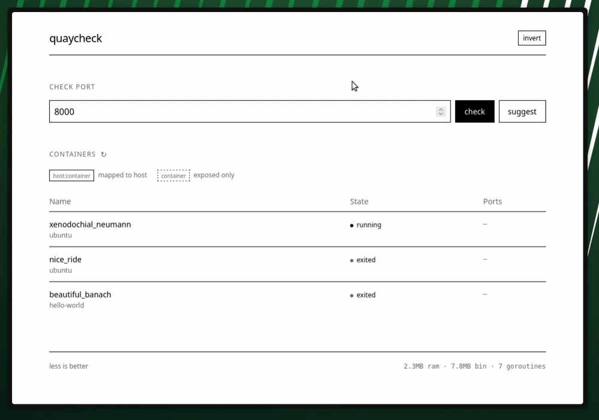

# quaycheck

A simple dashboard to see what ports your Docker containers are using. Helps you find free ports when spinning up new services.

[](LICENSE)
[](go.mod)
[](https://github.com/fabienpiette/quaycheck/releases)



<p align="center">
<a href="https://buymeacoffee.com/fabienpiette" target="_blank"></a>
</p>

## Why?

I kept running into port conflicts when starting new containers. Instead of running `docker ps` and squinting at the output, I wanted something I could just open in a browser.

## Features

- View all containers and their port mappings at a glance
- Check if a specific port is available
- Get suggestions for free ports
- Click any port to copy it to clipboard
- Dark/light theme toggle
- Minimal footprint (see stats in footer)

## Security

This doesn't mount the Docker socket directly. Instead, it uses [tecnativa/docker-socket-proxy](https://github.com/Tecnativa/docker-socket-proxy) as a read-only intermediary. The proxy only exposes container listing - no write access, no exec, no privileged nonsense.

## Usage

### Docker Compose

```yaml
services:
  quaycheck:
    image: ghcr.io/fabienpiette/quaycheck:latest
    ports:
      - "8080:8080"
    environment:
      - DOCKER_HOST=tcp://socket-proxy:2375
    depends_on:
      - socket-proxy

  socket-proxy:
    image: tecnativa/docker-socket-proxy
    volumes:
      - /var/run/docker.sock:/var/run/docker.sock:ro
    environment:
      - CONTAINERS=1
      - INFO=1
      - VERSION=1
      - POST=0
```

Then open http://localhost:8080

### From source

```bash
git clone https://github.com/fabienpiette/quaycheck.git
cd quaycheck
make up
```

## Config

| Variable | Default | Description |
|----------|---------|-------------|
| `DOCKER_HOST` | `tcp://socket-proxy:2375` | Docker API endpoint |
| `PORT` | `8080` | Web server port |

## Dev

```bash
make test          # run tests
make build         # build binary
make test-coverage # generate coverage report
```

Requires Go 1.24+

## License

AGPL-3.0
